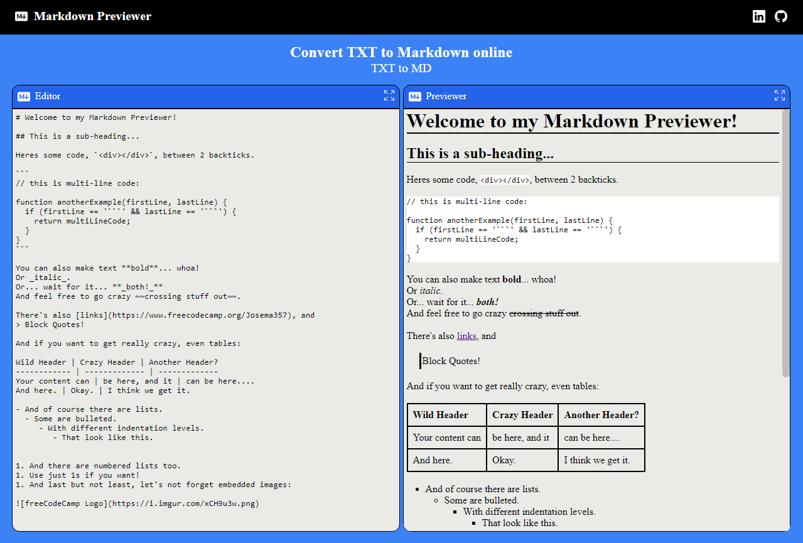
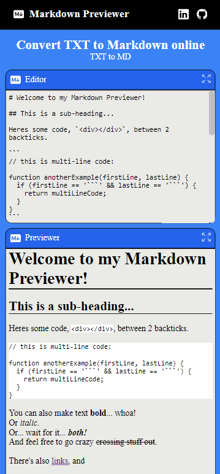

# Markdown Previewer
## Description
This project aims to build an application that reads text in md format and renders it as HTML. 
#
## Project Requirements
1. A textarea element with a corresponding id="editor".
2. An element with a corresponding id="preview".
3. When you enter text into the #editor element, the #preview element is updated as I type to display the content of the textarea.
4. When you enter GitHub flavored markdown into the #editor element, the text is rendered as HTML in the #preview element as you type.
5. When my markdown previewer first loads, the default text in the #editor field should contain valid markdown that represents at least one of each of the following elements: a heading element (H1 size), a sub heading element (H2 size), a link, inline code, a code block, a list item, a blockquote, an image, and bolded text.
6. When my markdown previewer first loads, the default markdown in the #editor field should be rendered as HTML in the #preview element.
#
## Technologies
To carry out this project the following tools, libraries and languages were used:
- JavaScript
- SASS
- React
- Redux
- Vitejs
- npm
- Bootstrap (icons)
#

#

#
## Known issues
Optional bonus: my markdown preview interprets carriage returns and renders them as br (line feed) elements.
This project does not meet this optional bonus.

#
## License

#
MIT

